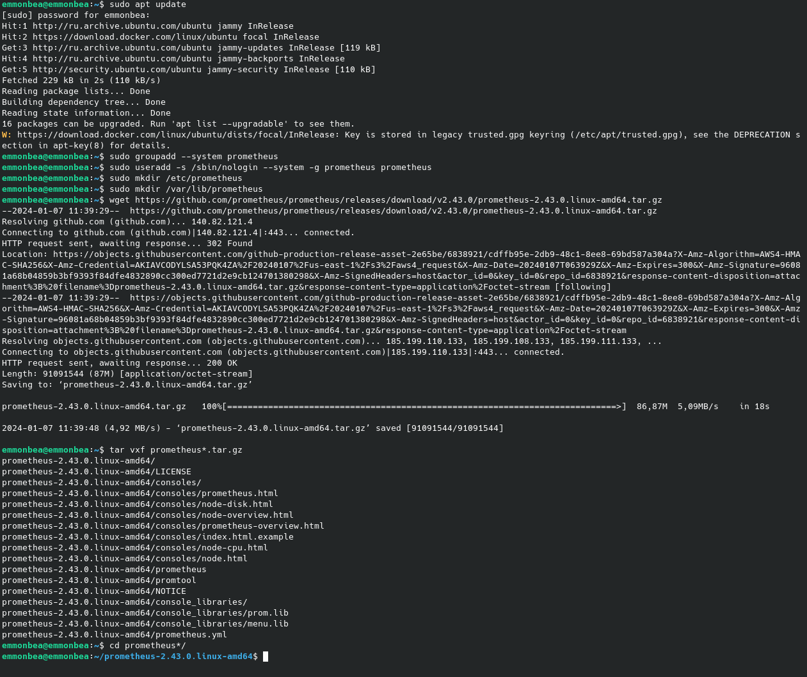
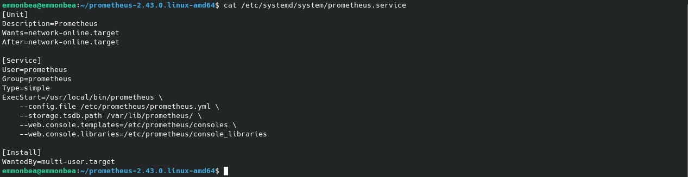
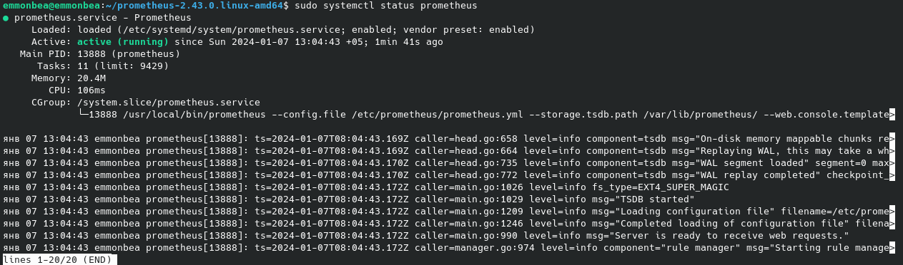

# Part 7. Prometheus и Grafana

## Содержание

1. [Установка Prometheus](#1-установка-prometheus)
2. [Настройка Prometheus](#2-настройка-prometheus)


## 1. Установка Prometheus <br/>

* Обновить системные пакеты: <br/>
  ```sh
  $ sudo apt update
  ```
* Создать системного пользователя для `Prometheus`<br/>
  ```sh
  $ sudo groupadd --system prometheus
  $ sudo useradd -s /sbin/nologin --system -g prometheus prometheus
  ```
  Создание пользователя для `Prometheus` с ограниченными правами снижает риск несанкционнированного доступа.<br/>

* Создание каталогов для `Prometheus`<br/>
  Для хранения конфигурационных файлов и библиотек Prometheus необходимо создать несколько каталогов.
  ```sh
  $ sudo mkdir /etc/prometheus
  $ sudo mkdir /var/lib/prometheus
  ```

* Загрузить `Prometheus` и извлечь файлы<br/>
  ```sh
  $ wget https://github.com/prometheus/prometheus/releases/download/v2.43.0/prometheus-2.43.0.linux-amd64.tar.gz

  $ tar vxf prometheus*.tar.gz
  ```

* Перейти в каталог Prometheus<br/>
  ```sh
  $ cd prometheus*/
  ```

  <br/>

[Содержание](#содержание)

## 2. Настройка Prometheus <br/>

* Переместить файлы и установить владельца:<br/>
  ```sh
  $ sudo mv prometheus /usr/local/bin
  $ sudo mv promtool /usr/local/bin
  $ sudo chown prometheus:prometheus /usr/local/bin/prometheus
  $ sudo chown prometheus:prometheus /usr/local/bin/promtool
  ```

* Переместить файлы конфигурации:<br/>
  ```sh
  $ sudo mv consoles /etc/prometheus
  $ sudo mv console_libraries /etc/prometheus
  $ sudo mv prometheus.yml /etc/prometheus
  ```

* Установить владельца:<br/>
  ```sh
  $ sudo chown prometheus:prometheus /etc/prometheus
  $ sudo chown -R prometheus:prometheus /etc/prometheus/consoles
  $ sudo chown -R prometheus:prometheus /etc/prometheus/console_libraries
  $ sudo chown -R prometheus:prometheus /var/lib/prometheus
  ```

* Настройка `Prometheus Systemd Service` для работы `Prometheus` в качестве службы:<br/>
  ```sh
  $ sudo vim /etc/systemd/system/prometheus.service
  ```

  <br/>

* Перезагрузить `systemd`<br/>
  ```sh
  $ sudo systemctl daemon-reload
  ```

* Запустить службу `Prometheus`<br/>
  ```sh
  $ sudo systemctl enable prometheus
  $ sudo systemctl start prometheus
  ```

* Проверить состояние `Prometheus`<br/>
  ```sh
  $ sudo systemctl status prometheus
  ```

  <br/>

* Проверить доступ к веб-интерфейсу `Prometheus`<br/>
  По умолчанию `Prometheus` работает на `порту 9090`, поэтому нужно разрешить `порт 9090` на брандмауэре:<br/>
  ```sh
  $ sudo ufw allow 9090/tcp
  ```

  <br/>

[Содержание](#содержание)