# Part 7. Prometheus и Grafana

## Содержание

1. [Установка Prometheus](#1-установка-prometheus)
2. [Настройка Prometheus](#2-настройка-prometheus)
3. [Установка Grafana](#3-установка-grafana)
4. [Настройка Grafana](#4-настройка-grafana)
5. [Создание дашборда в Grafana](#5-создание-дашборда-в-grafana)
6. [Мониторинг](#6-мониторинг)


## 1. Установка Prometheus

* Обновить системные пакеты: <br/>
  ```sh
  $ sudo apt update
  ```
* Создать системного пользователя для `Prometheus`<br/>
  ```sh
  $ sudo groupadd --system prometheus
  $ sudo useradd -s /sbin/nologin --system -g prometheus prometheus
  ```
  Создание пользователя для `Prometheus` с ограниченными правами снижает риск несанкционнированного доступа.<br/>

* Создание каталогов для `Prometheus`<br/>
  Для хранения конфигурационных файлов и библиотек Prometheus необходимо создать несколько каталогов.
  ```sh
  $ sudo mkdir /etc/prometheus
  $ sudo mkdir /var/lib/prometheus
  ```

* Загрузить `Prometheus` и извлечь файлы<br/>
  ```sh
  $ wget https://github.com/prometheus/prometheus/releases/download/v2.43.0/prometheus-2.43.0.linux-amd64.tar.gz

  $ tar vxf prometheus*.tar.gz
  ```

* Перейти в каталог Prometheus<br/>
  ```sh
  $ cd prometheus*/
  ```

  <br/>

[Содержание](#содержание)

## 2. Настройка Prometheus

* Переместить файлы и установить владельца:<br/>
  ```sh
  $ sudo mv prometheus /usr/local/bin
  $ sudo mv promtool /usr/local/bin
  $ sudo chown prometheus:prometheus /usr/local/bin/prometheus
  $ sudo chown prometheus:prometheus /usr/local/bin/promtool
  ```

* Переместить файлы конфигурации:<br/>
  ```sh
  $ sudo mv consoles /etc/prometheus
  $ sudo mv console_libraries /etc/prometheus
  $ sudo mv prometheus.yml /etc/prometheus
  ```

* Установить владельца:<br/>
  ```sh
  $ sudo chown prometheus:prometheus /etc/prometheus
  $ sudo chown -R prometheus:prometheus /etc/prometheus/consoles
  $ sudo chown -R prometheus:prometheus /etc/prometheus/console_libraries
  $ sudo chown -R prometheus:prometheus /var/lib/prometheus
  ```

* Настройка `Prometheus Systemd Service` для работы `Prometheus` в качестве службы:<br/>
  ```sh
  $ sudo vim /etc/systemd/system/prometheus.service
  ```

  <br/>

* Перезагрузить `systemd`<br/>
  ```sh
  $ sudo systemctl daemon-reload
  ```

* Запустить службу `Prometheus`<br/>
  ```sh
  $ sudo systemctl enable prometheus
  $ sudo systemctl start prometheus
  ```

* Проверить состояние `Prometheus`<br/>
  ```sh
  $ sudo systemctl status prometheus
  ```

  <br/>

* Проверить доступ к веб-интерфейсу `Prometheus`<br/>
  По умолчанию `Prometheus` работает на `порту 9090`, поэтому нужно разрешить `порт 9090` на брандмауэре:<br/>
  ```sh
  $ sudo ufw allow 9090/tcp
  ```

  <br/>

[Содержание](#содержание)

## 3. Установка Grafana

Перед следующими действиями необходимо включить VPN:<br/>

* Установить необходимые пакеты:<br/>
  ```sh
  $ sudo apt-get install -y apt-transport-https software-properties-common wget
  ```

* Импортировать ключ GPG:<br/>
  ```sh
  $ sudo mkdir -p /etc/apt/keyrings/

  $ wget -q -O - https://apt.grafana.com/gpg.key | gpg --dearmor | sudo tee /etc/apt/keyrings/grafana.gpg > /dev/null
  ```

* Чтобы добавить репозиторий для стабильных релизов, выполнить команду:<br/>
  ```sh
  $ echo "deb [signed-by=/etc/apt/keyrings/grafana.gpg] https://apt.grafana.com stable main" | sudo tee -a /etc/apt/sources.list.d/grafana.list
  ```

* Чтобы добавить репозиторий для бета-версий, выполнить команду:<br/>
  ```sh
  $ echo "deb [signed-by=/etc/apt/keyrings/grafana.gpg] https://apt.grafana.com beta main" | sudo tee -a /etc/apt/sources.list.d/grafana.list
  ```

* Обновить список доступных пакетов:<br/>
  ```sh
  $ sudo apt-get update
  ```

* Установить `Grafana OSS`:<br/>
  ```sh
  $ sudo apt-get install grafana
  ```

* Установить `Grafana Enterprise`:<br/>
  ```sh
  $ sudo apt-get install grafana-enterprise
  ```

[Содержание](#содержание)

## 4. Настройка Grafana

* Запустить службу `Grafana`<br/>
  ```sh
  $ sudo systemctl start grafana-server
  ```

* Включить автозапуск `Grafana` при загрузке:<br/>
  ```sh
  $ sudo systemctl enable grafana-server
  ```

* Проверить статус `Grafana`:<br/>
  ```sh
  $ sudo systemctl status grafana-server
  ```

  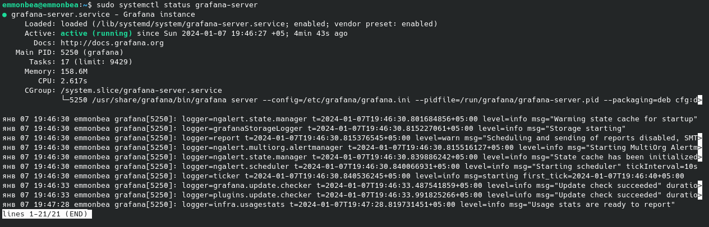<br/>

* Проверить доступ к веб-интерфейсу `Grafana`<br/>
  По умолчанию `Grafana` работает на `порту 3000`, поэтому нужно разрешить `порт 3000` на брандмауэре:<br/>
  ```sh
  $ sudo ufw allow 3000/tcp
  ```

  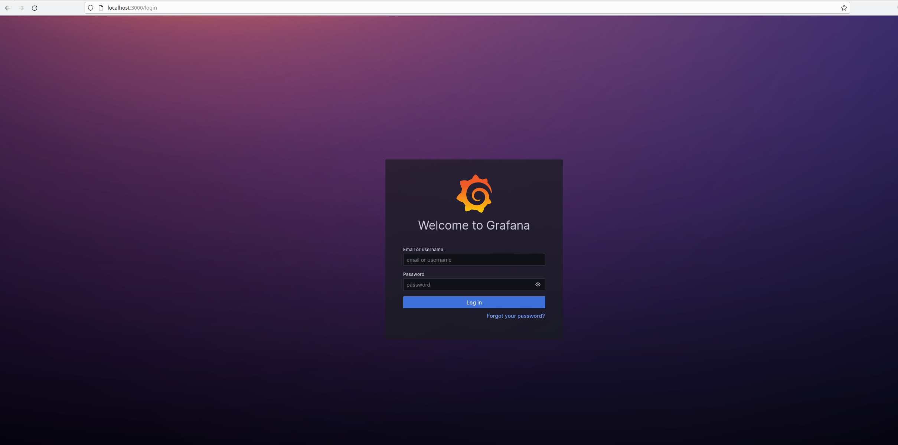<br/>

* При первом запуске ввести логин: `admin` и пароль: `admin`. После этого можно сменить пароль<br/>

* Перейти `Connections`->`Data sources`->`Add data source`<br/>

  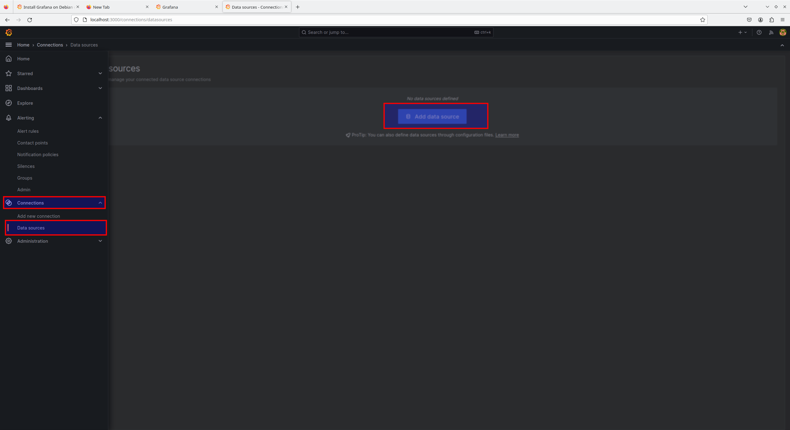<br/>

* В открывшемся окне выбрать `Prometheus`<br/>

  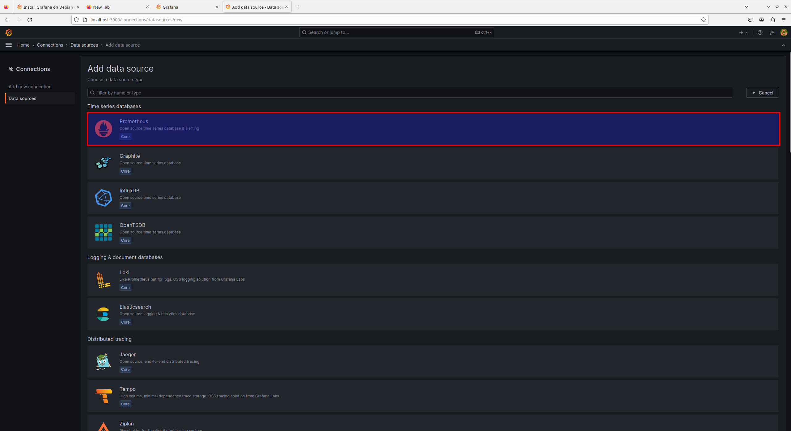<br/>

* В `Connection` указать URL `Prometheus` (по умолчанию: `http://localhost:9090`)

  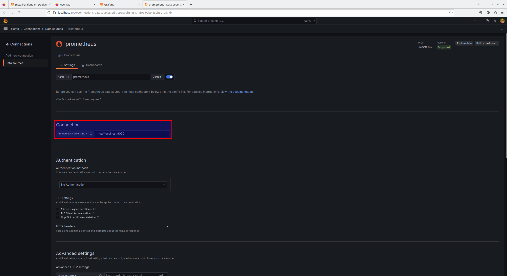<br/>

* Сохранить изменения `Save and Test`<br/>

[Содержание](#содержание)

## 5. Создание дашборда в Grafana

> P.S. Для выполнения задания понадобятся метрики `Node Exporter`. Установка и настройка `Node Exporter` представлена в Part_8.

* Панель отображения ЦПУ:<br/>
  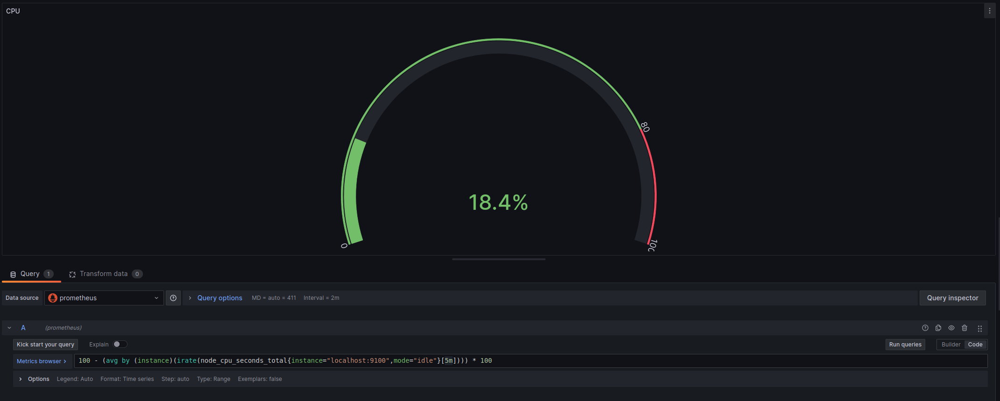<br/>

* Панель отображения доступной оперативной памяти:<br/>
  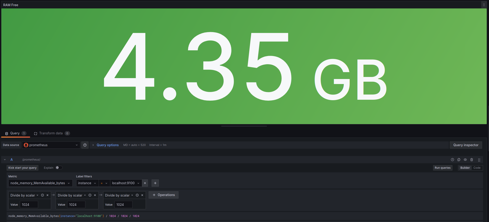<br/>

* Панель отображения сводного места:<br/>
  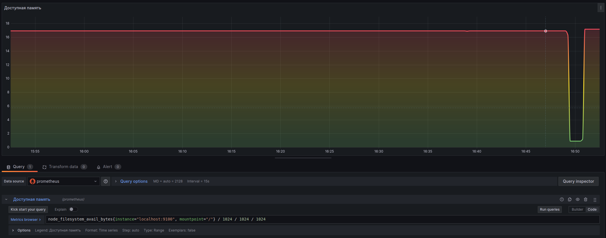<br/>

* Панель отображения количества операций ввода/вывода на жестком диске:<br/>
  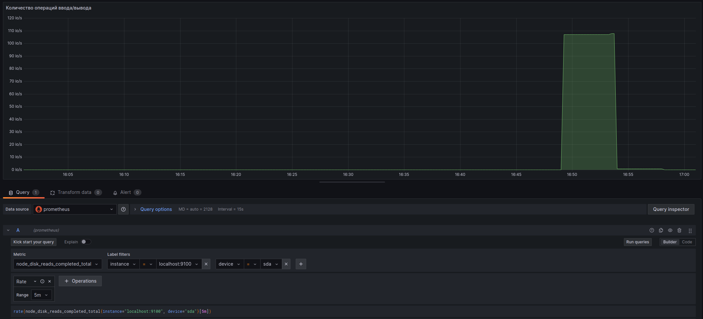<br/>

* Дашборд выглядит следующим образом:<br/>
  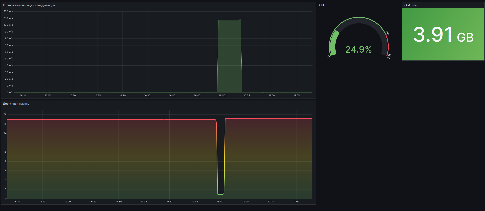<br/>

[Содержание](#содержание)

## 6. Мониторинг 

* Запустить ваш bash-скрипт из Части 2 и посмотреть на нагрузку жесткого диска (место на диске и операции чтения/записи)<br/>
  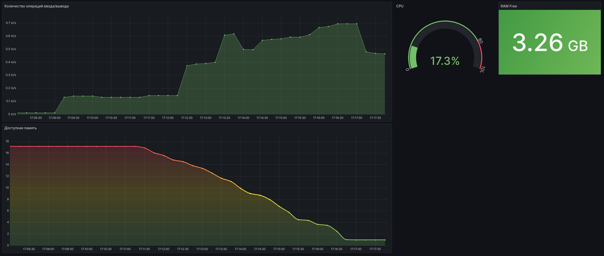<br/>

* Запустить ваш bash-скрипт из Части 3 и посмотреть на нагрузку жесткого диска (место на диске и операции чтения/записи)<br/>
  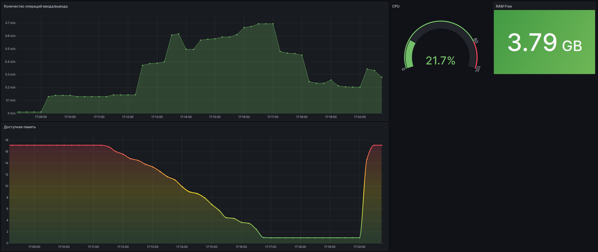<br/>

* Установить утилиту `stress`:<br/>
  ```sh
  $ sudo apt install stress
  ```

* Выполнить команду:<br/>
  ```sh
  $ stress -c 2 -i 1 -m 1 --vm-bytes 32M -t 10s
  ```

  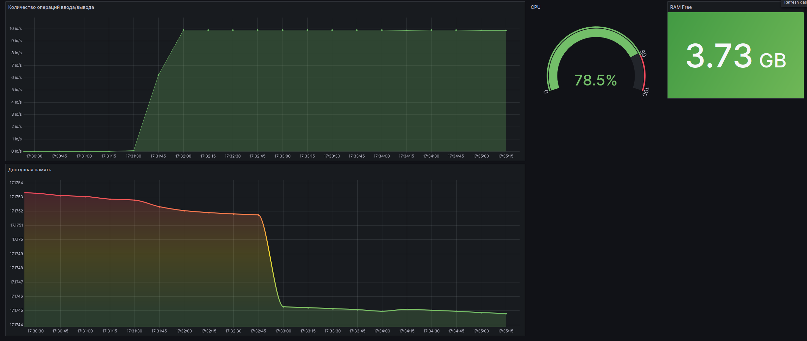<br/>


[Содержание](#содержание)