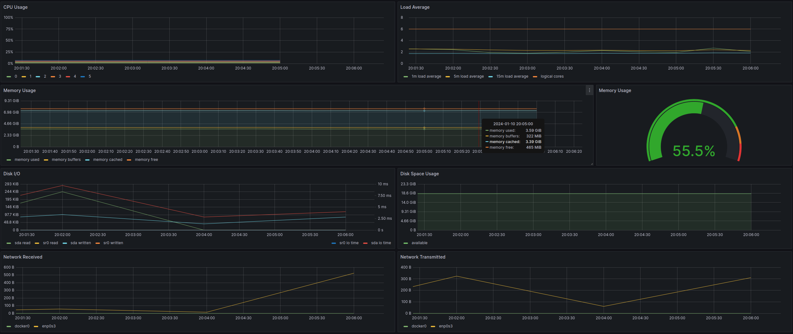
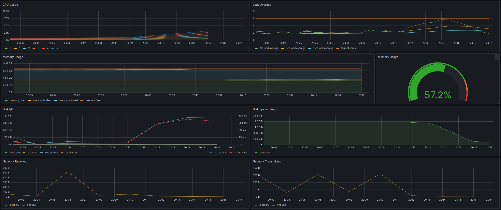
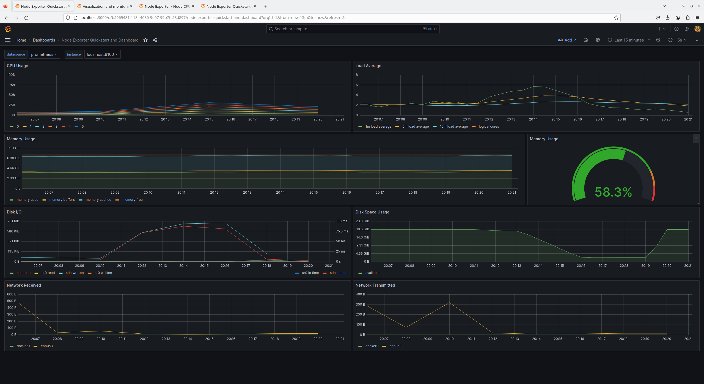

# Part 8. Готовый дашборд

## Содержание

1. [Установка Node Exporter](#1-установка-node-exporter)

## 1. Установка Node Exporter

* Скачать `Node Exporter`:<br/>
  ```sh
  $ wget https://github.com/prometheus/node_exporter/releases/download/v1.3.1/node_exporter-1.3.1.linux-amd64.tar.gz
  ```

* Распаковать архив:<br/>
  ```sh
  $ tar xvf node_exporter-1.3.1.linux-amd64.tar.gz
  ```

* Переместить бинарный файл:<br/>
  ```sh
  $ cd node_exporter-1.3.1.linux-amd64
  $ sudo cp node_exporter /usr/local/bin
  ```

* Удалить каталог, который создан после извлечения содержимого zip-файла:<br/>
  ```sh
  $ cd ..
  $ rm -rf ./node_exporter-1.3.1.linux-amd64
  ```

* Создать пользователя `Node Exporter`:<br/>
  ```sh
  $ sudo useradd --no-create-home --shell /bin/false node_exporter
  $ sudo chown node_exporter:node_exporter /usr/local/bin/node_exporter
  ```

* Создать и запустить службу `Node Exporter`:<br/>
  ```sh
  $ sudo vim /etc/systemd/system/node_exporter.service
  ```

  <br/>

* Перезагрузить `systemd`<br/>
  ```sh
  $ sudo systemctl daemon-reload
  ```

* Открыть доступ к `порту 9100`:<br/>
  ```sh
  $ sudo ufw allow 9100
  ```

* Разрешить входящий трафик на `порту 9100`:<br/>
  ```sh
  $ sudo iptables -I INPUT -p tcp -m tcp --dport 9100 -j ACCEPT
  ```

* Проверить доступ к веб-интерфейсу:<br/>
  <br/>

* Добавить цель для сбора метрик от `Node Exporter` в `Prometheus`:<br/>
  ```sh
  $ sudo vim /etc/prometheus/prometheus.yml
  ```

  <br/>

* Перезапустить службу `Prometheus`:<br/>
  ```sh
  $ sudo systemctl restart prometheus
  ```

* Проверить цели в веб-интерфейсе `Prometheus`:<br/>

  <br/>

[Содержание](#содержание)

## 2. Установка готового дашборда

* Скачать `Node Exporter Quickstart and Dashboard` .json<br/>
  ```
  https://grafana.com/grafana/dashboards/13978-node-exporter-quickstart-and-dashboard/
  ```

  <br/>

* Запустить bash-скрипт из Части 2 и посмотреть на нагрузку жесткого диска (место на диске и операции чтения/записи)<br/>
  <br/>

* Запустить bash-скрипт из Части 3 и посмотреть на нагрузку жесткого диска (место на диске и операции чтения/записи)<br/>
  <br/>

* Выполнить команду:<br/>
  ```sh
  $ stress -c 2 -i 1 -m 1 --vm-bytes 32M -t 100s
  ```

  <br/>

[Содержание](#содержание)