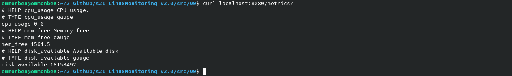
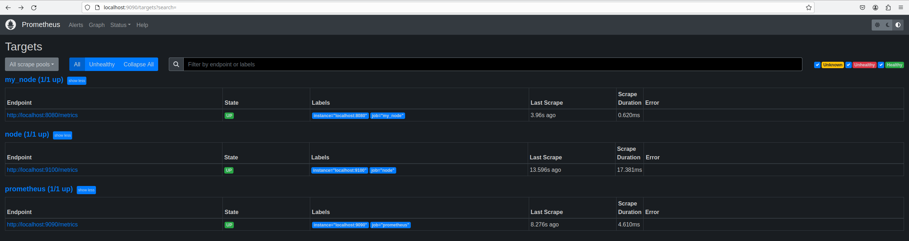
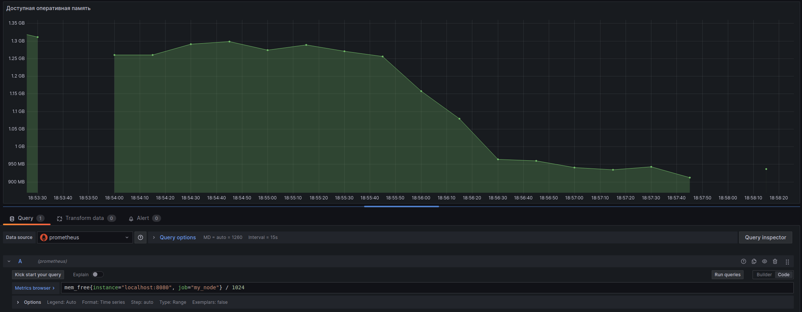
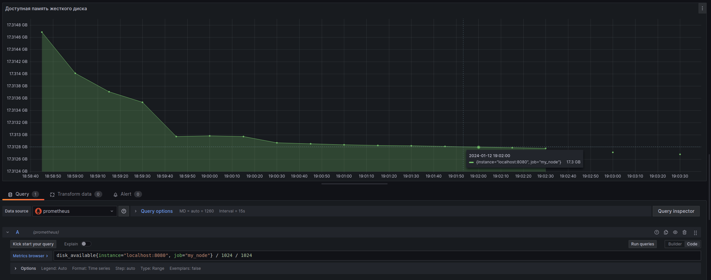
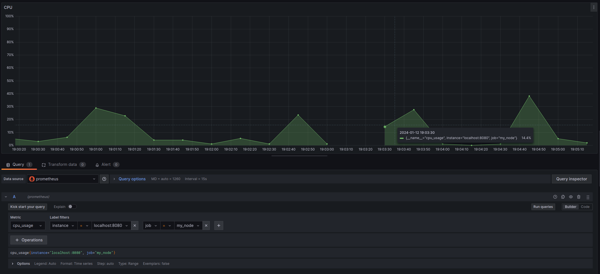
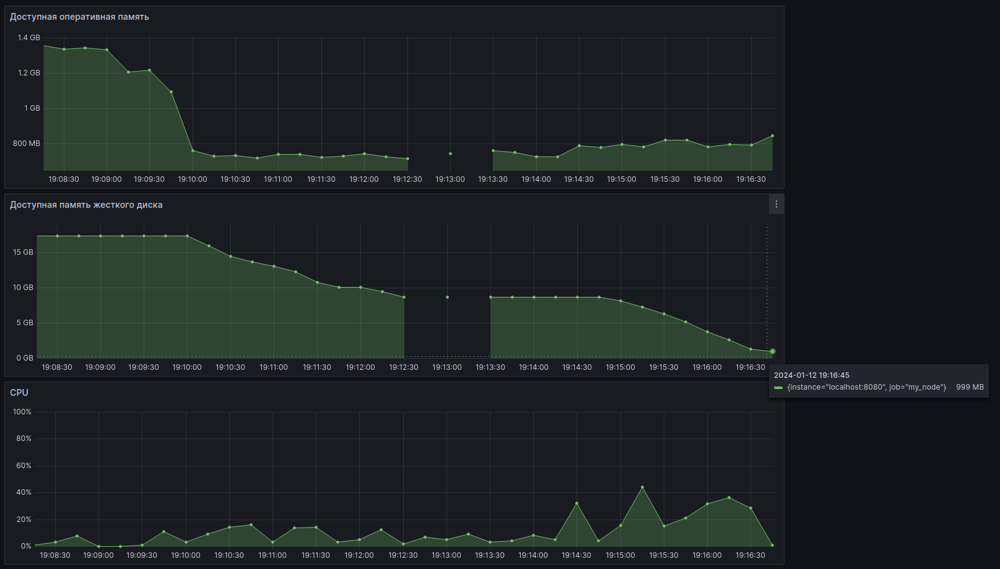
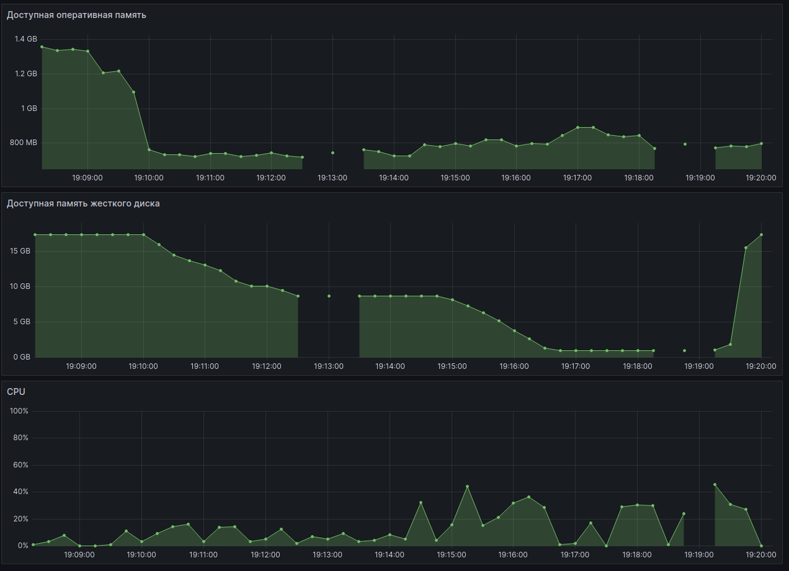
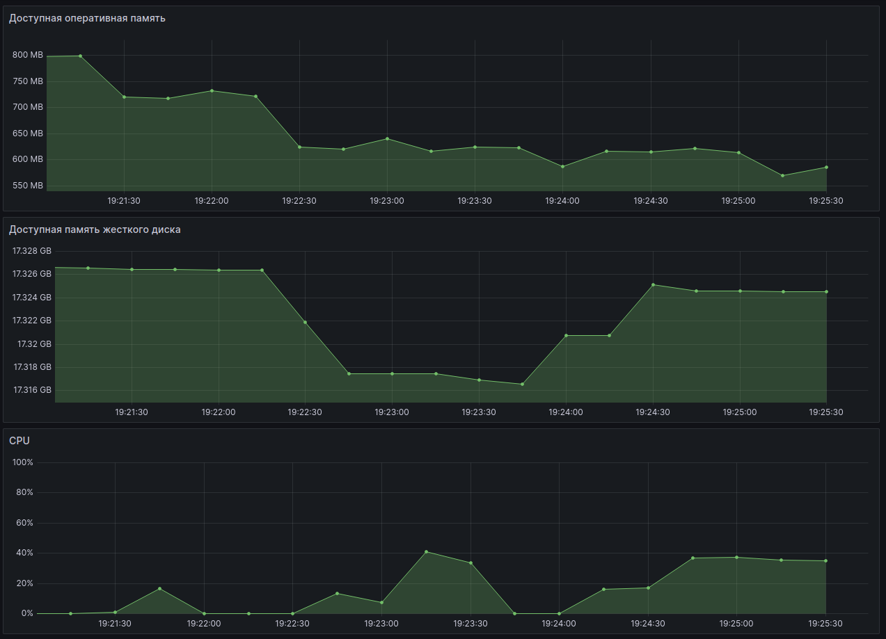

# Part 9. Дополнительно. Свой node_exporter

## Содержание

1. [Написать bash-скрипт](#1-написать-bash-скрипт)
2. [Установка и настройка nginx](#2-установка-и-настройка-nginx)
3. [Настройка Prometheus](#3-настройка-prometheus)
4. [Настройка дашборда](#4-настройка-дашборда)
5. [Мониторинг системы](#5-мониторинг-системы)

## 1. Написать bash-скрипт

* bash-скрипт собирает информацию по базовым метрикам системы (ЦПУ, оперативная память, жесткий диск (объем))<br/>

* Скрипт так же формирует html страницу каждые 3 секунды

[Содержание](#содержание)

## 2. Установка и настройка nginx

* Установить `nginx`:<br/>
  ```sh
  $ sudo apt install nginx
  ```

* Создать файл [nginx.conf](nginx.conf)<br/>

* Скопировать файл `nginx.conf` в системный каталог `/etc/nginx/`:<br/>
  ```sh
  $ sudo cp ./nginx.conf /etc/nginx/
  ```

* Добавить пользователя `www-data` в группу `emmonbea`:<br/>
  ```sh
  $ sudo usermod -aG emmonbea www-data
  ```

* Перезапустить службу `nginx`:<br/>
  ```sh
  $ systemctl restart nginx.service
  ```

* Проверить, что метрики доступны по адресу `http://localhost:8080/metrics/:`<br/>
  ```sh
  $ curl localhost:8080/metrics/
  ```

  <br/>

[Содержание](#содержание)

## 3. Настройка Prometheus

* Создать файл [prometheus.yml](prometheus.yml)<br/>

* Скопировать файл `prometheus.yml` в системный каталог:<br/>
  ```sh
  $ sudo cp ./prometheus.yml /etc/prometheus/
  ```

* Перезапустить службу `nginx`:<br/>
  ```sh
  $ systemctl restart prometheus.service
  ```

* Проверить подключение my_node `http://localhost:8080/metrics`<br/>
  <br/>

[Содержание](#содержание)

## 4. Настройка дашборда

* Настроить панель "Доступная оператиная память"<br/>
  <br/>

* Настроить панель "Доступная память жесткого диска"<br/>
  <br/>

* Настроить панель "CPU"<br/>
  <br/>

[Содержание](#содержание)

## 5. Мониторинг системы

* Система после запуска скрипта из Part_2<br/>
  <br/>

* Система после запуска скрипта из Part_3<br/>
  <br/>

* Система после выполнения команды:<br/>
  ```sh
  $ stress -c 2 -i 1 -m 1 --vm-bytes 32M -t 100s
  ```
  <br/>

[Содержание](#содержание)


